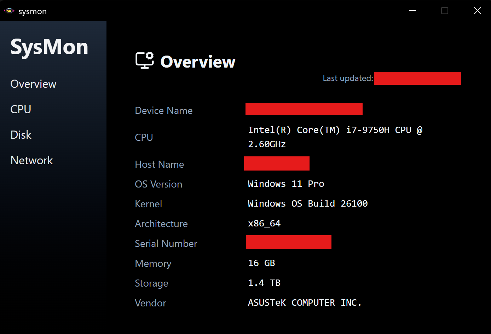

# SysMon.exe


A lightweight Windows system monitor that displays device info, real-time CPU & memory, per-core usage, disk usage & I/O, and network info with private/public IPs.

## Preview


## Installation
Download the latest `.exe` from [Releases](./src-tauri/target/release/sysmon-ui.exe).  

## Dev setup

```bash
git clone https://github.com/syttpz/sysmon.git
cd sysmon
npm install   
npm run tauri dev 
```

## Build
```bash
cd src-tauri
npm build
```
